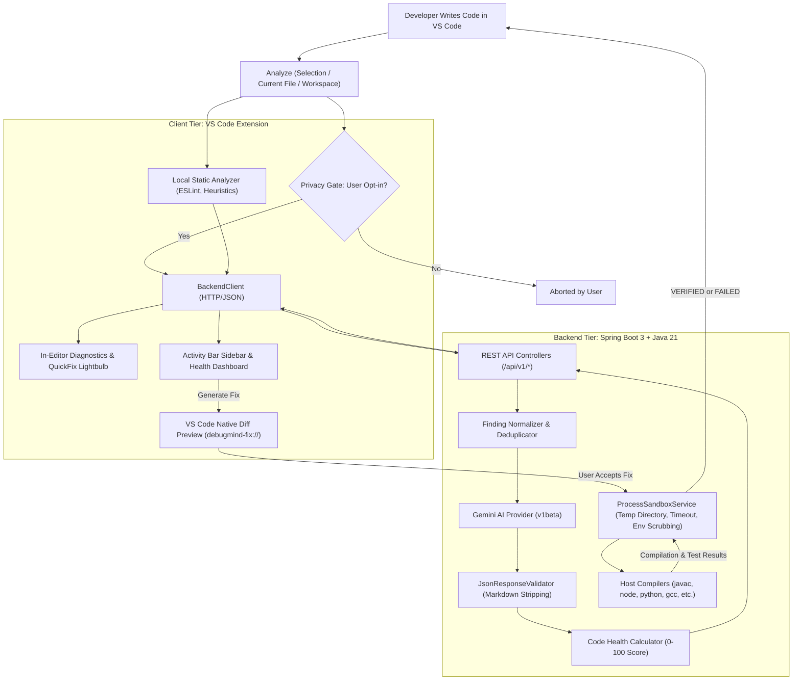

# DebugMind AI

<div align="center">

```
  ____       _                 __  __ _           _      _    ___ 
 |  _ \  ___| |__  _   _  __ _|  \/  (_)_ __   __| |    / \  |_ _|
 | | | |/ _ \ '_ \| | | |/ _` | |\/| | | '_ \ / _` |   / _ \  | | 
 | |_| |  __/ |_) | |_| | (_| | |  | | | | | | (_| |  / ___ \ | | 
 |____/ \___|_.__/ \__,_|\__, |_|  |_|_|_| |_|\__,_| /_/   \_\___|
                         |___/                                    
```

### **Detect. Explain. Fix. Verify.**

[](https://openjdk.org/)
[](https://spring.io/projects/spring-boot)
[](https://code.visualstudio.com/)
[](https://ai.google.dev/)
[](run-all-tests.bat)
[](LICENSE)

*An intelligent, hybrid developer assistant running directly inside Visual Studio Code. Pairs deterministic static analysis with Google Gemini AI to catch bugs, provide transparent 5-part engineering explanations, propose surgical line-targeted patches, generate unit tests, and deterministically verify fixes in an isolated sandbox.*

</div>

---

## 📑 Table of Contents

1. [Why DebugMind AI?](#-why-debugmind-ai)
2. [Core Architecture & Workflow](#-core-architecture--workflow)
3. [Key Features](#-key-features)
4. [Supported Languages & Toolchains](#-supported-languages--toolchains)
5. [Repository Structure](#-repository-structure)
6. [Quick Start Guide](#-quick-start-guide)
   - [Prerequisites](#prerequisites)
   - [1-Click Startup (Recommended)](#1-1-click-startup-recommended)
   - [Manual Backend Launch](#2-manual-backend-launch)
   - [Running the Extension in VS Code](#3-running-the-extension-in-vs-code)
   - [Running the Full Test Suite](#4-running-the-full-test-suite)
7. [REST API Reference](#-rest-api-reference)
8. [Configuration & Environment Variables](#-configuration--environment-variables)
9. [Extension Commands & Settings](#-extension-commands--settings)
10. [Troubleshooting & Gotchas](#-troubleshooting--gotchas)
11. [Project Documentation Links](#-project-documentation-links)
12. [License](#-license)

---

## 💡 Why DebugMind AI?

Most AI code assistants suffer from critical engineering flaws:
- **Hallucinated Verification**: They claim a patch "works" purely because a language model generated it, without testing it against compilers or automated suites.
- **Destructive Over-Refactoring**: They rewrite entire files and alter system architectures when a two-line defensive guard was all that was needed.
- **Opaque Reasoning**: They fail to explain *what* failed, *why* it failed, *where* the root cause is, and *what runtime consequences* it creates.
- **Privacy Blindspots**: They transmit proprietary codebases without granular consent or environment scrubbing.

**DebugMind AI solves this with a deterministic-first hybrid model:**
- **Deterministic Precedence**: Confirmed compiler warnings and high-confidence static lint patterns strictly supersede AI recommendations.
- **Surgical Line Edits**: Fixes are generated as minimal line replacements and previewed inside VS Code's native side-by-side diff editor (`debugmind-fix://`).
- **No Hallucinated Success**: Fixes are marked `VERIFIED` **only** after passing compilation and test suite execution in a sandboxed runner.
- **Privacy First**: Explicit user consent before transmitting any snippet, with automatic credential redaction in logs and environment variable scrubbing in child processes.
- **Offline Resilience**: Runs completely offline using deterministic heuristic static analysis and structured mock generators if no Gemini API key is configured.

---

## 🏗 Core Architecture & Workflow



---

## 🚀 Key Features

### 1. In-Editor Code Analysis & Diagnostics
- Integrates seamlessly with VS Code squiggles (Red = Error, Orange = Warning, Blue = Info).
- Heuristic detectors catch **SQL Injection String Concatenation**, **Hardcoded API Keys/Secrets**, **Empty Catch Blocks**, and **Command Injection Risks**.
- Automatically pulls active diagnostics from installed linters (ESLint, SpotBugs, Pylint, etc.).

### 2. Explainable Code Health Score (0–100)
Calculates a real-time risk score starting at 100 with weighted deductions:
- **CRITICAL** (Security vulnerabilities, injection): `-25 points`
- **HIGH** (Null pointer risks, crash risks): `-15 points`
- **MEDIUM** (Swallowed exceptions, leaks): `-8 points`
- **LOW** (Quality hints, suboptimal patterns): `-3 points`
- **INFO** (Style guidelines): `-1 point`

### 3. Structured 5-Part Engineering Explanations
Explanations render in a dedicated VS Code Dashboard Webview tab broken down into:
1. **What is wrong?** — Clear technical description of the defect.
2. **Why does it happen?** — Underlying conditions leading to failure.
3. **Where does it happen?** — Exact line and column coordinates.
4. **What is the impact?** — Runtime crashes, data corruption, or security risks.
5. **How should it be fixed?** — Concrete engineering remediation steps.

### 4. Surgical Fixes & Native Side-by-Side Diff Preview
- Fixes generate targeted line replacements without altering untouched code.
- Opens side-by-side inside VS Code's native diff interface using the custom `debugmind-fix://` virtual document scheme.
- Developer reviews diff and clicks **Accept Fix** (applies `WorkspaceEdit` directly to file) or **Reject Fix**.

### 5. Deterministic Process Sandbox Verification
- Never hallucinate verification! When an applied fix is verified, DebugMind spins up an isolated temporary folder.
- Sanitizes the environment (removes any variables containing `KEY`, `SECRET`, `TOKEN`, or `PASSWORD`).
- Enforces an execution timeout (default 15 seconds) to prevent infinite loops.
- Runs compiler checks (`javac`, `node --check`, `py_compile`, `gcc -fsyntax-only`) and automated test suites (`pytest`, `junit`, `node`).

### 6. Compiler Error & Stack Trace Analyzer
- Parse stack traces from Java, Node.js, Python, C/C++, PHP, and Dart.
- Triggered directly from active editor selection, terminal clipboard, or manual input box.
- Automatically opens the offending file, jumps to the exact line number, and explains the root cause.

---

## 💻 Supported Languages & Toolchains

| Language | Extensions | Static Analyzers / Compilers | Default Test Framework |
|---|---|---|---|
| **Java** | `.java` | `javac`, SpotBugs, Checkstyle | JUnit 5 |
| **JavaScript** | `.js`, `.mjs`, `.cjs`, `.jsx` | `node --check`, ESLint | Jest / Vitest / Mocha |
| **TypeScript** | `.ts`, `.tsx` | TypeScript Language Server, ESLint | Jest / Vitest |
| **Python** | `.py`, `.pyw` | `python -m py_compile`, Ruff, Pylint | PyTest / Unittest |
| **C / C++** | `.c`, `.cpp`, `.cc`, `.h` | `gcc -fsyntax-only`, `g++ -fsyntax-only` | Google Test / Unity |
| **Dart** | `.dart` | Dart Analyzer | Flutter Test |
| **PHP** | `.php`, `.phtml` | `php -l`, PHPStan | PHPUnit |

---

## 📁 Repository Structure

```text
DEBUGMIND AI/
├── .env.example                                  # Environment variables template
├── .gitignore                                    # Git ignore rules
├── README.md                                     # Master technical guide (this file)
├── run-backend.bat                               # 1-Click Windows backend launcher with auto-port freeing
├── run-backend.ps1                               # 1-Click PowerShell backend launcher
├── run-all-tests.bat                             # Automated test suite runner (Extension + Backend)
├── .vscode/                                      # VS Code IDE launch & task definitions
│   ├── launch.json                               # F5 Debug Host configuration
│   └── tasks.json                                # Backend start, test, and package tasks
├── tools/                                        # Bundled offline utilities
│   └── apache-maven-3.9.6/                       # Bundled portable Apache Maven
├── project-docs/                                 # Complete architectural specifications
│   ├── prd.md                                    # Product Requirements Document
│   ├── architecture.md                           # System Topology & Mermaid diagrams
│   ├── rules.md                                  # Engineering Standards & Hard "Never-Do" Rules
│   ├── design.md                                 # Visual tokens, colors & Webview layout
│   ├── task.md                                   # Task checklist & future roadmap
│   └── memory.md                                 # Session state, decisions log & assumptions
└── debugmind-ai/
    ├── backend/                                  # Spring Boot 3.3.4 (Java 21) REST Backend
    │   ├── mvnw / mvnw.cmd                       # Self-contained Maven Wrapper
    │   ├── pom.xml                               # Maven project POM
    │   └── src/
    │       ├── main/java/com/debugmind/          # Application source code
    │       ├── main/resources/application.yml    # Backend configuration properties
    │       └── test/java/com/debugmind/          # Backend JUnit 5 & MockMvc tests
    └── extension/                                # VS Code Extension (Plain JavaScript)
        ├── extension.js                          # Extension activation entrypoint
        ├── package.json                          # Extension manifest & command contributions
        ├── media/                                # Sidebar HTML5/CSS3 assets, icons & webview.js
        ├── src/                                  # Commands, diagnostics, services & webviews
        └── test/                                 # Mocha unit tests & test runner
```

---

## 🏁 Quick Start Guide

### Prerequisites
- **Java**: Java 21 LTS (`java -version`)
- **Node.js**: Node 18+ (tested on Node 24, `node -v`)
- **Visual Studio Code**: 1.85.0 or newer
- **Maven**: Bundled inside `tools/apache-maven-3.9.6/` or via included Maven Wrapper (`mvnw.cmd`).

---

### 1. 1-Click Startup (Recommended)

#### Start Backend Server:
Double-click [`run-backend.bat`](file:///c:/Git%20Project/VS%20Extensiton%20project/DEBUGMIND%20AI/run-backend.bat) from Windows Explorer, or in PowerShell run:
```powershell
.\run-backend.bat
```
*(This script automatically detects and frees port 8080 if occupied, then boots Spring Boot).*

#### Verify Backend Health:
```powershell
Invoke-RestMethod -Uri "http://localhost:8080/api/v1/health" -Method Get | ConvertTo-Json
```
Expected output:
```json
{
  "status": "UP",
  "aiProvider": "gemini",
  "model": "gemini-1.5-flash",
  "sandboxAvailable": true
}
```

---

### 2. Manual Backend Launch

If running manually via terminal:
```bash
cd debugmind-ai/backend
.\mvnw.cmd spring-boot:run
```

To configure live Google Gemini AI, copy `.env.example` to `.env` and set your key:
```env
GEMINI_API_KEY=your_actual_gemini_api_key_here
GEMINI_MODEL=gemini-1.5-flash
SERVER_PORT=8080
```
*(If `GEMINI_API_KEY` is omitted, the backend automatically runs in deterministic offline mock mode).*

---

### 3. Running the Extension in VS Code

1. Open this repository in VS Code:
   ```bash
   code .
   ```
2. Press <kbd>F5</kbd> (or select **"Launch DebugMind AI Extension"** from the Run & Debug menu).
3. A new **Extension Development Host** window opens with DebugMind AI fully active!
4. Look for the 🧠 icon in the Activity Bar on the left.

---

### 4. Running the Full Test Suite

To verify that both the VS Code Extension unit tests and the Spring Boot Backend integration tests pass with 100% success, execute:
```cmd
.\run-all-tests.bat
```
Output:
```text
=======================================================
         Running DebugMind AI Test Suites
=======================================================

[1/2] Running VS Code Extension Unit Tests...
  6 passing (4ms)

[2/2] Running Spring Boot Backend Tests...
  Tests run: 13, Failures: 0, Errors: 0, Skipped: 0
  BUILD SUCCESS

=======================================================
    ALL TESTS PASSED SUCCESSFULLY! (100% GREEN)
=======================================================
```

---

## 🌐 REST API Reference

The Spring Boot backend exposes 8 REST API endpoints under `/api/v1`:

| Method | Endpoint | Request Body | Description |
|---|---|---|---|
| `GET` | `/api/v1/health` | None | Returns health status, AI provider, active model, and sandbox status. |
| `POST` | `/api/v1/analyze` | `AnalyzeRequest` | Performs full analysis on a file or snippet (combines static + AI). |
| `GET` | `/api/v1/analyses` | None | Fetches in-memory analysis history (last 50 runs). |
| `POST` | `/api/v1/issues/explain` | `ExplainRequest` | Returns structured 5-part engineering breakdown for a detected issue. |
| `POST` | `/api/v1/issues/fix` | `FixRequest` | Generates surgical line replacement edits (`CodeEditDto[]`). |
| `POST` | `/api/v1/tests/generate` | `GenerateTestRequest` | Generates a complete standalone test suite for the specified framework. |
| `POST` | `/api/v1/errors/analyze` | `ErrorAnalyzeRequest` | Identifies root cause and fix recommendation for compiler/runtime errors. |
| `POST` | `/api/v1/fixes/verify` | `VerifyFixRequest` | Executes code in the isolated process sandbox and returns test results. |

---

## ⚙️ Configuration & Environment Variables

### Backend Configuration (`application.yml` / `.env`)

| Variable | Default Value | Description |
|---|---|---|
| `SERVER_PORT` | `8080` | Port for the Spring Boot REST API. |
| `GEMINI_API_KEY` | *(empty)* | Google Gemini API key. If empty, offline mock mode is used. |
| `GEMINI_MODEL` | `gemini-1.5-flash` | Gemini model (e.g. `gemini-1.5-flash`, `gemini-1.5-pro`). |
| `GEMINI_BASE_URL` | `https://generativelanguage.googleapis.com` | Base URL for Google AI API. |
| `SANDBOX_TIMEOUT_SECONDS` | `15` | Maximum execution time before child sandbox processes are killed. |
| `SANDBOX_TEMP_DIR` | *(empty = system temp)* | Optional custom directory for execution sandboxes. |

### VS Code Extension Settings (`settings.json`)

| Setting Key | Default | Description |
|---|---|---|
| `debugmind.backendUrl` | `http://localhost:8080` | URL of the local or remote Spring Boot service. |
| `debugmind.aiProvider` | `gemini` | Configured AI provider. |
| `debugmind.geminiModel` | `gemini-1.5-flash` | Default Gemini model. |
| `debugmind.askBeforeSending` | `true` | Show privacy confirmation dialog before transmitting code. |
| `debugmind.sendSourceCode` | `true` | Master permission allowing code context transmission. |
| `debugmind.autoAnalyze` | `false` | Automatically trigger analysis on file save. |
| `debugmind.enableWorkspaceAnalysis`| `false` | Enable multi-file workspace architectural scanning. |

---

## ⌨️ Extension Commands & Settings

Accessible via the VS Code Command Palette (<kbd>Ctrl</kbd>+<kbd>Shift</kbd>+<kbd>P</kbd> or <kbd>Cmd</kbd>+<kbd>Shift</kbd>+<kbd>P</kbd>):

- `DebugMind: Analyze Selected Code` — Analyze highlighted lines in editor.
- `DebugMind: Analyze Current File` — Run static & AI inspection on the open file.
- `DebugMind: Analyze Workspace` — Scan repository manifests and analyze entry points.
- `DebugMind: Explain Issue` — Display full 5-stage explanation in dashboard.
- `DebugMind: Fix Issue` — Generate patch and open native side-by-side diff.
- `DebugMind: Generate Tests` — Generate unit tests matching active file framework.
- `DebugMind: Analyze Error` — Parse compiler error or stack trace from input/selection.
- `DebugMind: Run Verification` — Execute compiler and tests in sandbox.
- `DebugMind: Open Dashboard` — Open Code Health score and analysis history tab.
- `DebugMind: Clear Diagnostics` — Dismiss all in-editor squiggles and reset state.

---

## 🔧 Troubleshooting & Gotchas

### 1. Port 8080 Collision (`Web server failed to start. Port 8080 was already in use`)
If a previous backend process was left running:
- Run [`run-backend.bat`](file:///c:/Git%20Project/VS%20Extensiton%20project/DEBUGMIND%20AI/run-backend.bat) (it automatically kills the conflicting process).
- Or kill it manually in PowerShell:
  ```powershell
  Stop-Process -Id (Get-NetTCPConnection -LocalPort 8080).OwningProcess -Force
  ```

### 2. Maven Not Found in Terminal (`mvn : The term 'mvn' is not recognized`)
- Always use `.\mvnw.cmd` inside `debugmind-ai/backend` (the self-contained wrapper).
- Or run [`run-backend.bat`](file:///c:/Git%20Project/VS%20Extensiton%20project/DEBUGMIND%20AI/run-backend.bat), which references the bundled Maven distribution in `tools/apache-maven-3.9.6/`.

### 3. Testing Languages in Process Sandbox
The sandbox runs native compilers and test runners installed on your host machine:
- To verify Java fixes: ensure `javac` is in your `PATH`.
- To verify JavaScript fixes: ensure `node` is in your `PATH`.
- To verify Python fixes: ensure `python` and `pytest` are installed.
- *If a compiler or test runner is missing, the sandbox cleanly reports syntax status (`PARTIAL`) without crashing.*

---

## 📚 Project Documentation Links

For comprehensive engineering specifications, refer to the [`project-docs/`](file:///c:/Git%20Project/VS%20Extensiton%20project/DEBUGMIND%20AI/project-docs/) directory:

- 📋 [**Product Requirements Document (PRD)**](file:///c:/Git%20Project/VS%20Extensiton%20project/DEBUGMIND%20AI/project-docs/prd.md) — User stories, feature status matrix, acceptance criteria.
- 📐 [**System Architecture**](file:///c:/Git%20Project/VS%20Extensiton%20project/DEBUGMIND%20AI/project-docs/architecture.md) — Topology, Mermaid diagrams, data models, sandbox design.
- 📏 [**Engineering Guidelines & Rules**](file:///c:/Git%20Project/VS%20Extensiton%20project/DEBUGMIND%20AI/project-docs/rules.md) — Naming conventions, layer rules, hard "never-do" list for AI agents.
- 🎨 [**Visual Design & UI Specs**](file:///c:/Git%20Project/VS%20Extensiton%20project/DEBUGMIND%20AI/project-docs/design.md) — CSS tokens, color palettes, typography, Webview layouts.
- 📝 [**Task Checklist & Roadmap**](file:///c:/Git%20Project/VS%20Extensiton%20project/DEBUGMIND%20AI/project-docs/task.md) — Verified completed tasks and future phases.
- 🧠 [**Session Memory & Decisions Log**](file:///c:/Git%20Project/VS%20Extensiton%20project/DEBUGMIND%20AI/project-docs/memory.md) — Architecture decisions log, known edge cases, gotchas.

---

## 📄 License

This project is licensed under the [MIT License](file:///c:/Git%20Project/VS%20Extensiton%20project/DEBUGMIND%20AI/debugmind-ai/extension/LICENSE).
