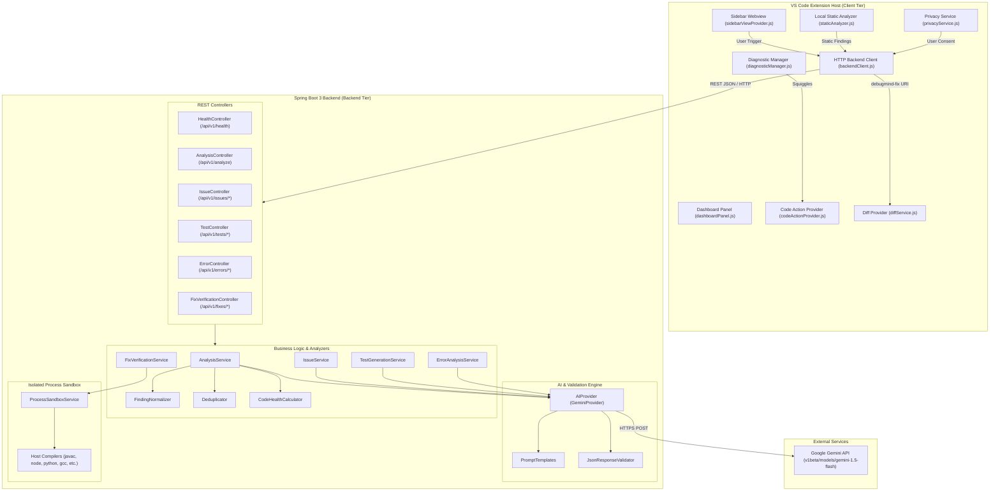
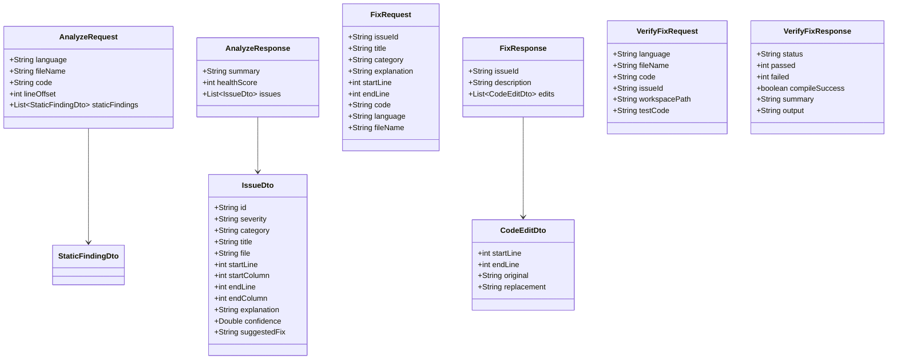

# System Architecture Document - DebugMind AI

## 1. System Overview

DebugMind AI is split into two primary runtime subsystems:
1. **VS Code Extension (Client Tier)**: Built in pure JavaScript (ES6+ CommonJS) running within the VS Code Extension Host. It intercepts editor events, executes local regex-based heuristic linting, manages custom diagnostics and CodeActions, mounts reactive Webview views, presents native side-by-side diff previews via a custom TextDocumentContentProvider (`debugmind-fix://`), and orchestrates user privacy gates.
2. **Spring Boot 3.3.4 Service (Backend Tier)**: Built in Java 21 LTS running locally on port 8080 (or custom configured port). It coordinates AI prompt construction, communicates with Google Gemini API, validates and sanitizes LLM JSON output, normalizes static findings, deduplicates issues, calculates code health, and executes deterministic process sandbox checks.



---

## 2. Repository Structure & Layer Responsibilities

```text
c:\Git Project\VS Extensiton project\DEBUGMIND AI\
├── .env.example                                  # Template for environment configuration
├── .gitignore                                    # Git exclusion rules
├── README.md                                     # Root repository quick-start guide
├── run-backend.bat / run-backend.ps1             # One-click backend startup with auto-port freeing
├── run-all-tests.bat                             # One-click full verification test suite runner
├── .vscode/                                      # VS Code IDE launch configurations & tasks
│   ├── launch.json                               # F5 Extension Development Host launch configuration
│   └── tasks.json                                # Build, test, and run tasks
├── tools/                                        # Local bundled utilities
│   └── apache-maven-3.9.6/                       # Bundled portable Apache Maven
│
├── project-docs/                                 # Architectural & project documentation
│   ├── prd.md                                    # Product requirements and feature matrix
│   ├── architecture.md                           # System architecture, schemas, and diagrams
│   ├── rules.md                                  # Coding standards and agent rules
│   ├── design.md                                 # Visual design, color tokens, and webview specs
│   ├── task.md                                   # Granular task roadmap and tracking
│   └── memory.md                                 # Session state, decisions, and gotchas
│
└── debugmind-ai/
    ├── README.md                                 # In-depth technical architecture documentation
    ├── backend/                                  # Spring Boot 3.3.4 Backend (Java 21)
    │   ├── pom.xml                               # Maven project POM
    │   ├── mvnw / mvnw.cmd                       # Maven Wrapper scripts
    │   ├── .mvn/wrapper/                         # Maven Wrapper distribution properties
    │   └── src/
    │       ├── main/java/com/debugmind/
    │       │   ├── DebugMindApplication.java     # Spring Boot application entrypoint
    │       │   ├── ai/                           # AI provider abstractions, Gemini client, validators
    │       │   ├── analyzer/                     # Finding normalizer, deduplicator, health score
    │       │   ├── config/                       # CORS filter and security headers configuration
    │       │   ├── controller/                   # Spring MVC REST API controllers
    │       │   ├── dto/                          # Immutable request and response DTOs
    │       │   ├── exception/                    # Global exception handlers and error models
    │       │   ├── execution/                    # Process sandbox execution runner
    │       │   └── service/                      # Application business logic services
    │       ├── main/resources/
    │       │   ├── application.yml               # Backend service properties and Gemini configuration
    │       │   └── db/migration/                 # Flyway PostgreSQL schema migration (V1)
    │       └── test/                             # JUnit 5 & SpringBootTest integration test suites
    │
    └── extension/                                # VS Code Extension (Node.js CommonJS)
        ├── extension.js                          # Extension activation & registration lifecycle
        ├── package.json                          # Extension manifest, commands, menus, config
        ├── media/                                # Webview icons, CSS themes, client JS
        ├── src/
        │   ├── commands/                         # Command registrations (Analyze, Explain, Fix, etc.)
        │   ├── diagnostics/                      # VS Code DiagnosticCollection & CodeActionProvider
        │   ├── providers/                        # Terminal selection provider
        │   ├── services/                         # BackendClient, DiffService, PrivacyService, FixService
        │   ├── utils/                            # LanguageDetector, StaticAnalyzer, WorkspaceScanner, Logger
        │   └── webview/                          # Webview providers (Sidebar, Welcome, Dashboard)
        └── test/                                 # Test runner and Mocha/built-in unit test suite
```

---

## 3. State Management, Routing, and Dependency Injection

### 3.1 VS Code Extension (Client)
- **Dependency Injection**: Manual composition and singleton export pattern (e.g., `module.exports = new BackendClient();`, `module.exports = new DiagnosticManager();`).
- **State Management**:
  - `diagnosticManager.js`: Holds in-memory `Map<fileUriString, IssueDto[]>` and `Set<ignoredIssueIds>` synchronized with `vscode.languages.createDiagnosticCollection('DebugMind')`.
  - `analysisService.js`: Holds `latestAnalysis` object and dispatches updates via `vscode.EventEmitter` to the reactive sidebar.
  - `diffService.js`: Maintains `Map<fixKey, PendingFix>` for active virtual documents mounted under the `debugmind-fix:` scheme.
  - `privacyService.js`: Holds `sessionApproved` in-memory boolean alongside `vscode.workspace.getConfiguration('debugmind')` global persistence.
- **Routing**: Message-driven event routing in `SidebarViewProvider` listening on `webviewView.webview.onDidReceiveMessage` and dispatching to `vscode.commands.executeCommand`.

### 3.2 Spring Boot Backend (Server)
- **Dependency Injection**: Standard Spring Inversion of Control (IoC) with constructor injection across all Controllers and Services (e.g., `AnalysisController` receives `AnalysisService`).
- **Routing**: Spring MVC annotation-driven routing with explicit base paths (`/api/v1/health`, `/api/v1/analyze`, `/api/v1/issues`, `/api/v1/tests`, `/api/v1/errors`, `/api/v1/fixes`).
- **State Management**: Stateless REST architecture. Analysis history is stored in an in-memory thread-safe `CopyOnWriteArrayList<AnalyzeResponse>` (capped at 50 records) for the local MVP tier.

---

## 4. Data Models & Database Schema

### 4.1 In-Memory & DTO Object Model



### 4.2 Relational Database Schema (`V1__initial_schema.sql`)
The repository includes a Flyway schema for production PostgreSQL environments:
- **`users`**: `(id PK, username UNIQUE, email UNIQUE, created_at)`
- **`projects`**: `(id PK, user_id FK, name, root_path, language, created_at)`
- **`analyses`**: `(id PK, project_id FK, file_name, language, health_score, summary, created_at)`
- **`issues`**: `(id PK, analysis_id FK, issue_code, severity, category, title, start_line, end_line, start_column, end_column, explanation, suggested_fix, confidence, created_at)`
- **`fixes`**: `(id PK, issue_id FK, description, status, edits_json, created_at)`
- **`test_runs`**: `(id PK, fix_id FK, status, passed_count, failed_count, compile_success, output_log, created_at)`

*Note: In the current local deployment, `@SpringBootApplication(exclude = {DataSourceAutoConfiguration.class})` runs without requiring an external PostgreSQL instance.*

---

## 5. API Specification

| Method | Path | Request Body | Response Body | Description |
|---|---|---|---|---|
| `GET` | `/api/v1/health` | None | `HealthResponse` | Returns service status, active AI provider, model, and sandbox status. |
| `POST` | `/api/v1/analyze` | `AnalyzeRequest` | `AnalyzeResponse` | Analyzes code snippet or file; combines static findings with Gemini AI. |
| `GET` | `/api/v1/analyses` | None | `List<AnalyzeResponse>` | Fetches recent analysis history (capped at 50 in-memory entries). |
| `POST` | `/api/v1/issues/explain` | `ExplainRequest` | `ExplainResponse` | Generates 5-part engineering explanation for an issue. |
| `POST` | `/api/v1/issues/fix` | `FixRequest` | `FixResponse` | Produces surgical line-targeted patches (`CodeEditDto[]`). |
| `POST` | `/api/v1/tests/generate` | `GenerateTestRequest` | `GenerateTestResponse` | Generates complete unit test file matching detected framework. |
| `POST` | `/api/v1/errors/analyze` | `ErrorAnalyzeRequest` | `ErrorAnalyzeResponse` | Analyzes compiler errors, exceptions, or terminal stack traces. |
| `POST` | `/api/v1/fixes/verify` | `VerifyFixRequest` | `VerifyFixResponse` | Runs syntax check and unit test suite inside isolated sandbox. |

---

## 6. Third-Party Services & AI Integration Flow

### 6.1 Google Gemini AI Integration
- **Endpoint**: `${GEMINI_BASE_URL:https://generativelanguage.googleapis.com}/v1beta/models/${GEMINI_MODEL:gemini-1.5-flash}:generateContent?key=${GEMINI_API_KEY}`
- **Payload Structure**: `{ "contents": [{ "parts": [{ "text": "<Prompt>" }] }] }`
- **System Rules Enforced in Prompts**:
  1. Analyze *only* supplied code evidence; no invented files or external dependencies.
  2. Output strict JSON matching specified schemas (stripped of markdown fences via `JsonResponseValidator`).
  3. Real confidence scores (0.0 to 1.0).
  4. Minimal surgical patches rather than broad refactorings.
  5. Never claim a fix is verified without test execution.

### 6.2 Offline Mock Mode Strategy
When `GEMINI_API_KEY` is not set:
- `GeminiProvider.isAvailable()` evaluates to `false`.
- Instead of throwing network or authentication exceptions, `generateOfflineMockResponse(prompt)` returns structured, deterministic mock responses for analysis, explanation, fix generation, test generation, and error analysis.
- Allows complete offline development, unit testing, and extension demonstration without an internet connection or paid API quota.

---

## 7. Security, Privacy & Error Handling Architecture

### 7.1 Privacy Architecture
- **Consent Gate**: `PrivacyService.confirmSendSource()` prompts the developer before any code leaves the client. Choices: "Allow Once", "Allow for Session", "Always Allow" (updates configuration), or "Cancel".
- **Redaction**: `logger.js` automatically sanitizes output channels, redacting Google API keys (`AIza...`), password fields, and generic API tokens.
- **Stateless Cloud Communication**: No user code is stored on external cloud databases.

### 7.2 Sandbox Security
- `ProcessSandboxService` executes processes using `ProcessBuilder` in generated temporary directories (`Files.createTempDirectory`).
- **Environment Sanitization**: Prior to launching any compiler or test process, the execution environment map is scrubbed of all variables containing `KEY`, `SECRET`, `TOKEN`, or `PASSWORD`.
- **Execution Timeout**: Configurable timeout (default 15 seconds, test 5 seconds). Over-running processes are terminated forcibly (`process.destroyForcibly()`).
- **Automatic Teardown**: Temporary directories are recursively deleted in a `finally` block.

### 7.3 Error Handling
- **Server Tier**: `GlobalExceptionHandler` intercepts `AIProviderException` (maps 429 to 429 Too Many Requests, others to 502 Bad Gateway), `MethodArgumentNotValidException` (maps to 400 Bad Request), and generic unhandled exceptions (maps to 500 Internal Server Error with clean JSON messages).
- **Client Tier**: `BackendClient` intercepts HTTP connection refusal (`ECONNREFUSED`), status errors, and parse failures, presenting human-readable messages and guidance in VS Code notifications.

---

## 8. Technical Debt & Architectural Risks

1. **Host-Dependent Sandbox Toolchains**:
   - *Risk*: `ProcessSandboxService` calls `javac`, `node`, `pytest`, `gcc`, and `php` directly on the host machine. If a developer attempts to verify Python code on a machine without `pytest`, the test step fails.
   - *Mitigation*: Fallback to compile-only syntax verification (`PARTIAL` status) when test runners are absent from the host `PATH`.
2. **In-Memory History Volatility**:
   - *Risk*: Restarting the backend clears analysis history stored in `AnalysisService.analysisHistory`.
   - *Mitigation*: Activate H2 embedded database or link PostgreSQL using Spring Data JPA.
3. **CommonJS Extension Bundle**:
   - *Risk*: Plain JavaScript lacks static type guarantees at build time compared to TypeScript.
   - *Advantage*: Zero compilation overhead, instantaneous launch, but requires strict unit testing in `test/suite/staticAnalyzer.test.js`.
4. **Single File Analysis on Workspace Scan**:
   - *Risk*: `workspaceScanner.js` scans workspace structure but currently only opens and analyzes the first entry point file.
